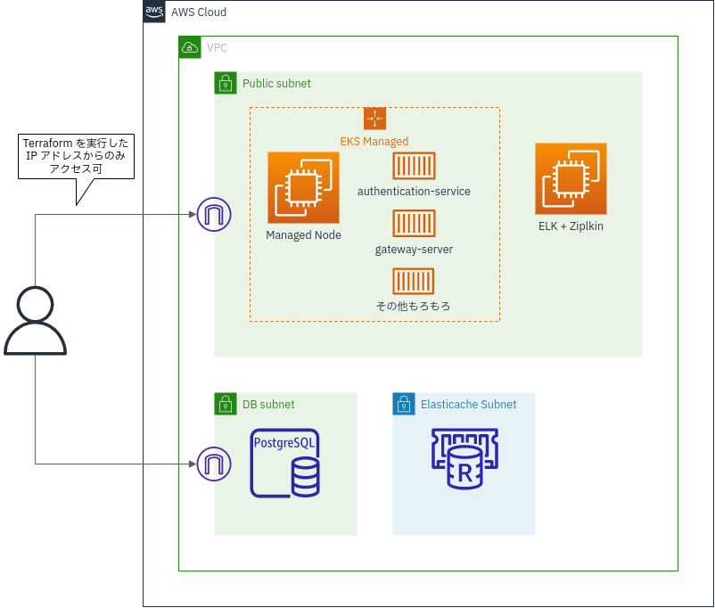

my-smia
=======

[Spring Microservices in Action, Second Edition](https://amzn.to/3TSpkqM) の最終成果物を構築する為のリポジトリ。

https://github.com/ihuaylupo/manning-smia/tree/master/chapter12 を元にしています。

動作環境
----

ローカル開発環境は Xubuntu 22.04.1 LTS x86_64 上に構築しています。

[Docker Desktop](https://www.docker.com/products/docker-desktop/) for Linux を、ローカルの Docker 環境及び
Kubernetes 環境として利用しています。

IDE は [IntelliJ IDEA Ultimate](https://www.jetbrains.com/lp/intellij-frameworks/) を利用しています。

Kubernetes のマニフェスト生成に [ytt](https://carvel.dev/ytt/docs/latest/) を利用しています。

タスクランナーとして [Task](https://taskfile.dev/) を利用しています。

Java のバージョンは [.sdkmanrc](.sdkmanrc) を、 Terraform のバージョンは [versions.tf](./terraform/versions.tf)
をそれぞれ参照して下さい。

構成図
------



構築手順
--------

### ローカル環境

各環境で設定を揃える目的で、以下を `/etc/hosts` に記載します:

```
127.0.1.1       keycloak zipkin eureka-server logstash kibana kafka database redis
127.0.1.1       authentication-service gateway-server config-server
```

Docker 内や Kubernetes 内は上記のホスト名でサービス間の通信を行っている為、
ローカルで立ち上げた際にも同じホスト名でアクセス出来るように設定しています。

*これは単に、環境毎に設定を切り替えるのを簡略化する為の方針です。*
*環境毎に設定を最適化した方が、ポート番号の制約等も生まれない為、望ましいとは思います。*

次に、DB などの依存サービスを以下で立ち上げます:

``` sh
task docker:compose:up-externals
```

`.env.local` を元に、 Spring Boot の各種設定ファイルを生成します:

``` sh
task generate:config-files
```

生成されたファイルは `config/local/` 及び `config-repo/local/` 以下に配置されます。

Configuration サーバーで読み込む為の追加の `bootstrap.yml` が `config` に配置されるファイルです。
暗号鍵が記載されます。

`config-repo` 以下には、各種アプリケーションが Confugration サーバーを介して参照するための設定ファイルが配置されます。

#### `mvn spring-boot:run` で実行

以下のように各アプリケーションを立ち上げます
(実際には別ターミナルでそれぞれ実行するか、バックグラウンドで実行させるか等が必要です):

``` sh
(cd apps/config-server && mvn spring-boot:run)
(cd apps/eureka-server && mvn spring-boot:run)
(cd apps/authentication-service && mvn spring-boot:run)
(cd apps/licensing-service && mvn spring-boot:run)
(cd apps/organization-service && mvn spring-boot:run)
(cd apps/gateway-server && mvn spring-boot:run)
```

以下で動作確認が出来ます:

``` sh
http -A bearer -a \
  $(http --form -a ostock:thisissecret POST authentication-service:8082/oauth/token \
      grant_type='password' username='illary.huaylupo' password='password1' | \
      jq '.access_token' -r) \
  GET gateway-server:8072/license/v1/organization/d898a142-de44-466c-8c88-9ceb2c2429d3/license/f2a9c9d4-d2c0-44fa-97fe-724d77173c62
```

http://kibana:5601/ でアプリケーションログを確認したり、 http://zipkin:9411/ でトレースを確認することが出来ます。

#### IntelliJ IDEA から実行

実行構成として `all apps` を実行すると、全てのアプリケーションが立ち上がります。

動作確認方法は `mvn spring-boot:run` の場合と同様です。

#### docker compose で実行

以下を実行すると、アプリケーションイメージのビルド、実行が行われます:

``` sh
task apps:build-images docker:compose:up
```

動作確認方法は `mvn spring-boot:run` の場合と同様です。

#### Docker Desktop の Kubernetes 上で実行

以下を実行すると、アプリケーションイメージのビルド、及び Kubernetes へのデプロイが行われます:

``` sh
task apps:build-images k8s:all
```

動作確認は以下のように行います:

``` sh
http -A bearer -a \
  $(http --form -a ostock:thisissecret POST localhost:31300/oauth/token \
      grant_type='password' username='illary.huaylupo' password='password1' | \
      jq '.access_token' -r) \
  GET localhost:31200/license/v1/organization/d898a142-de44-466c-8c88-9ceb2c2429d3/license/f2a9c9d4-d2c0-44fa-97fe-724d77173c62
```

Kibana や Zipkin はこれまでと共通です。

### AWS 環境

**使用状況に応じて料金が発生します。**

[Infracost](https://www.infracost.io/) を実行したところ 1 ヶ月で $128.74 との結果でした。
使い終わったら必ず `terraform destroy` しましょう。 `destroy` 後に料金が発生しないことは確認しています。

まずは Terraform で環境を作ります。 `terraform` ディレクトリで作業します:

``` sh
cd terraform && terraform init
```

`variables.tf` を参考に、 `.tfvars` を作成します。

[IAM roles for service accounts](https://docs.aws.amazon.com/eks/latest/userguide/iam-roles-for-service-accounts.html)
の関係で
IAM の操作も必要になります。

[aws-vault](https://github.com/99designs/aws-vault) を利用する場合は、MFA の設定が必要になります
(
参考 https://github.com/99designs/aws-vault/blob/v6.6.0/USAGE.md#temporary-credentials-limitations-with-sts-iam )
。

以降、 `default` プロファイルが MFA を使わない設定、 `mfa` プロファイルが MFA を使う設定をしている想定で記載します。

Terraform で AWS 上にリソースを構築します:

``` sh
aws-vault exec mfa -- terraform apply
```

全ての環境構築には 20 分程度かかります。

環境構築が終わったら、まずは ELK + Zipkin 用のインスタンスを準備します。

以下で docker compose に必要なファイルを転送します:

``` sh
scp -r -i ../my-smia.pem ../AWS/EC2/ ec2-user@$(aws-vault exec default -- terraform output -raw elkz_public_ip):~/
```

続いて、各種コンテナを起動します:

``` sh
ssh -i ../my-smia.pem ec2-user@$(aws-vault exec default -- terraform output -raw elkz_public_ip) docker-compose --file EC2/docker-compose.yml --project-directory EC2 up -d
```

ここまで終わったら、以降はプロジェクトルートで作業します:

``` sh
cd ../
```

Terraform で作成された `.env.aws` ファイルを元に、必要な設定ファイル群を生成します:

``` sh
ENV=aws task generate:config-files
```

RDS に初期データを投入します:

``` sh
ENV=aws task db:seed
```

Kubernets で実行するイメージのビルド、 push し、デプロイします:

``` sh
ENV=aws aws-vault exec default -- task docker:ecr:login docker:ecr:push:all k8s:all
```

ここまでで環境構築は終わりです。

以下でアクセストークンが取得出来ます:

``` sh
http --form -a ostock:thisissecret POST \
     "$(cd terraform; aws-vault exec default -- terraform output -raw eks_node_public_ip):31300/oauth/token" \
     grant_type='password' username='illary.huaylupo' password='password1' | jq '.access_token' -r
```

このアクセストークンで、以下のように動作確認出来ます:

``` sh
http -A bearer -a "ACCESS_TOKEN" \
     "$(cd terraform; aws-vault exec default -- terraform output -raw eks_node_public_ip):31200/license/v1/organization/d898a142-de44-466c-8c88-9ceb2c2429d3/license/f2a9c9d4-d2c0-44fa-97fe-724d77173c62"
```

ELK + Zipkin が稼動しているインスタンスのパブリック IP は以下で確認出来ます:

``` sh
aws-vault exec default -- terraform output -raw elkz_public_ip
```

`5601` ポートでは Kibana が、 `9411` ポートでは Zipkin が動いていることを確認出来ます。
